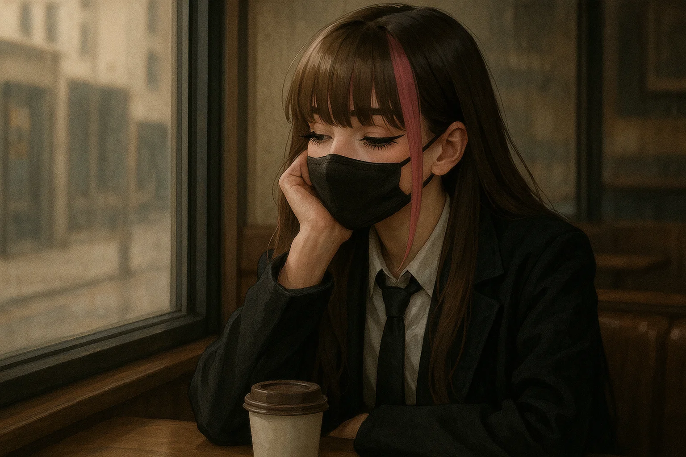
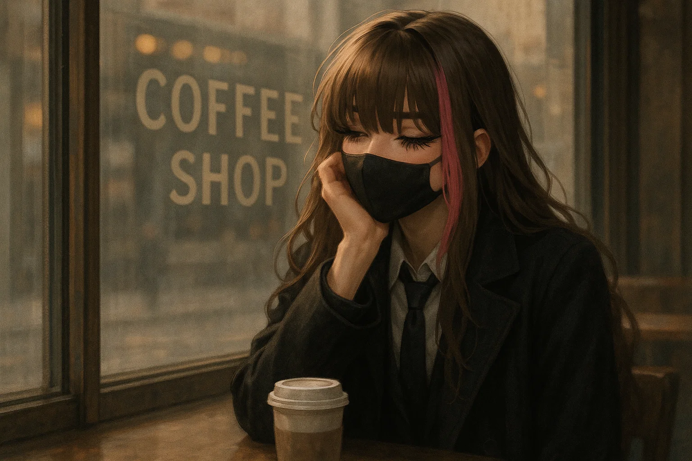
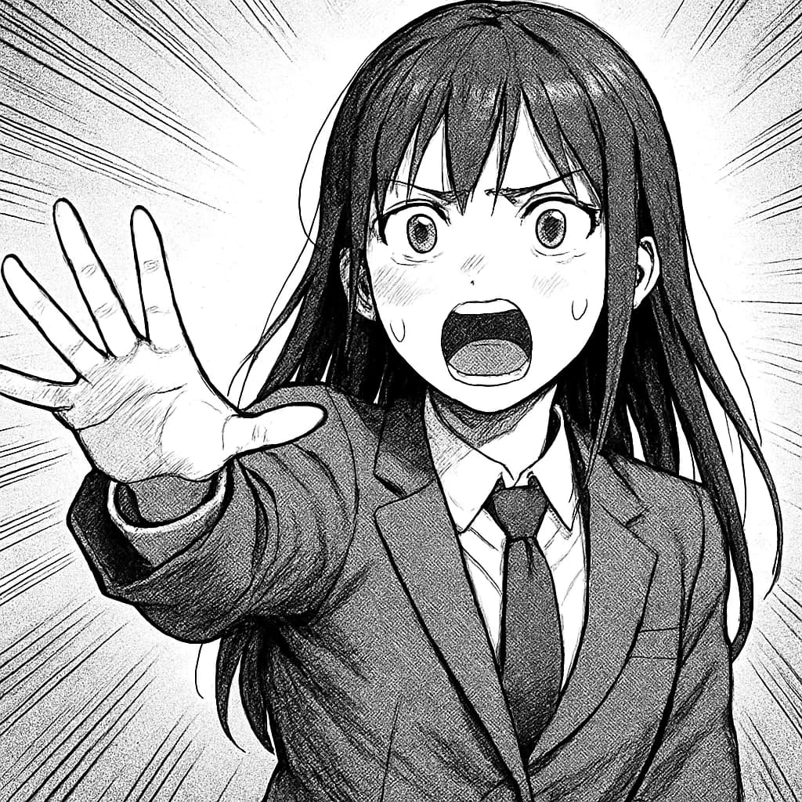
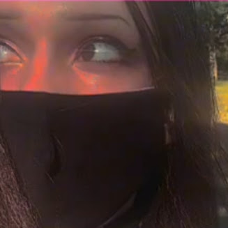
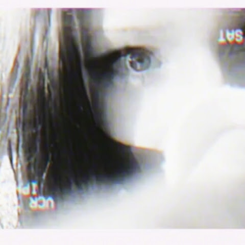
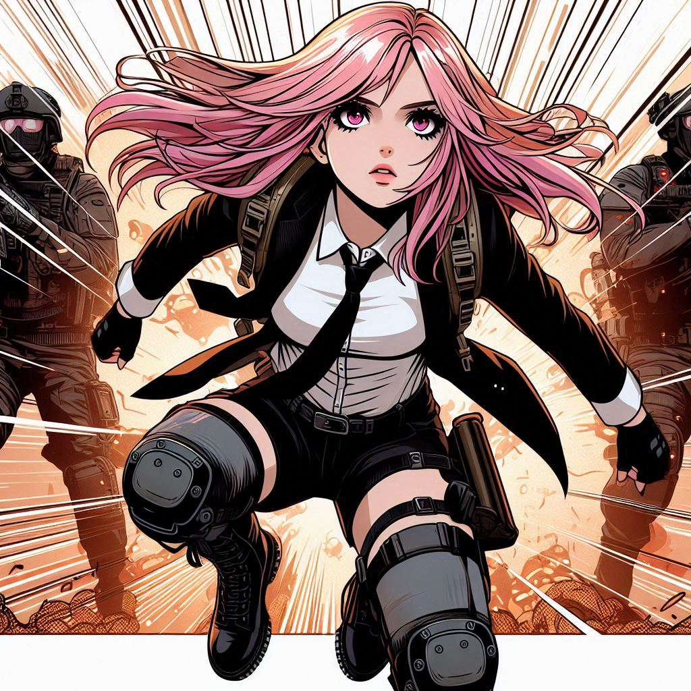

# Autobiography

<!--  -->

## Summary
How would I summarize my entire life in a single paragraph? in a single sentence? in a single word? in a symbol?

I've learned that a human life is very fragile thing. And also we human beings can be incredibly anti-fragile, surviving impossible odds. What is this? It's our true nature. But that's as far as I can write... the rest is up to you to discover. 

## Trauma
But I've done such incredible work. I want to continue and I want to fulfill my life's purpose and I want to share my work publicly. That's the whole reason I created my website, because I realized I love writing in Obsidian. I created my own little world full of my memories and my stories and even my research. I was able to create my own personal university and turn something as overwhelming as dozens of my sprawling interests as a polymath into something that not only helps me, but could help so many souls like me someday. But all of that is overwhelming. And I understand because I'm not there yet. I'm still in the liminal zone of the RPG. Not exactly completely healed, but also no longer chained by the helplessness of mental illness. Because that's exactly what it feels like when you are mentally ill for so long, you feel helpless. And when you cry out for help, people do not understand how to help you. Because it takes scars on your body or something visible for people to understand the pain you're in inside your head. And thank God I didn't hurt myself after my teenage years where I used to self-harm and it was progressing really bad. And it was all because of what I saw online. And and I remember when I would see those images of teenagers posting what they've done to their body online, I was shocked, but I also felt like I finally found a place where I belong, a place where people are so broken that they hate themselves enough to share it online because they feel worthless. But they also secretly still want to be loved. And that's what those scars mean. It means I'm crying out for help. I'm on my last threads. I need someone to help me. I need someone to give me a sign of life. Or I'm gonna obliterate my existence. Because living in my head is a constant torment every day.

## The meaning paradox
*“Meaning doesn't have to be complicated. it just has to be enough to sustain you.”*

You would think that the more meaningful you want your life to be, the better it will be right? In my case it became a burden to carry so much with me. I was holding onto things that weren't my own... taking responsibility becuase i didn't see anyone else doing anything...

## What am I?

Those are words I've often asked myself

I've been having hundreds, thousands, tens of thousands, probably hundreds of thousands of writings scattered across my life throughout the years. It's really the only threads that have kept me together when my psyche was literally fragmenting and falling apart to the point where no other art was available to me. I feel like when your body is so sick, it sort of screams to you in its last breaths and it stops letting you cope. And that's why even the most beautiful music, illustrations, ideas, lyrics, even memories, all of a sudden started disappearing and it was like my universe on the inside was falling asleep. That's when I had to look at all of the parts of me that I didn't want to face. But I also had to realize what I needed to let go of, the things that were polluting my inner garden. And by writing, I'm externalizing and letting go of things that are not my own. That's also the essential idea of my universe, personas. Each persona is a way of me interacting with parts of myself or external forces that I can't hold as part of my integrated being because that would just be too overwhelming. I would end up having hundreds of personalities. And I think at one point in my life, I didnt' recognize who I was in the mirror... I saw someone... but I didn't trust that person...  I didn't know who was looking back at me in the mirror.

## A dream
Someday I'll read this autobiography outloud, the same way many people who have helped me with their stories, did for me. Whenever I hear an author of their own book, read their own story out loud... it's... it is... the most beautiful...

## We crave what is real
We human beings crave what is real. So much of what we experience is not "real" in the sense of it's external... alot of our experience comes from our internal world and procesing. Without getting into ridiculous details, essentially we seriously value what is real.

That is why vicariously living through others online, feels like betrayal to your own soul... 