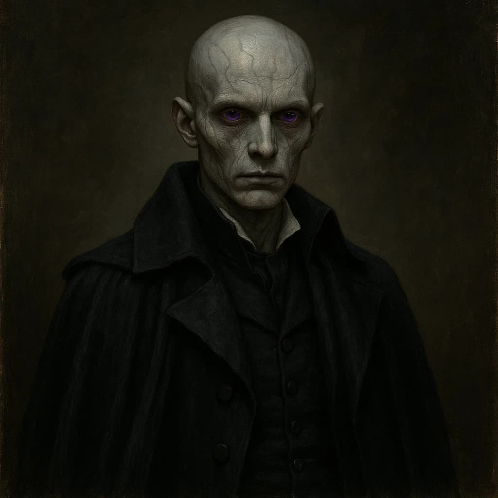

# Fredereich Mooder
"Humanity is a slave to their emotions and desires, we must cleanse and remove this vile creature, so that the pure form is revivified... so that my children may play and dance... once more."

Frederich Mooder was a member of the Mooder royal family.

