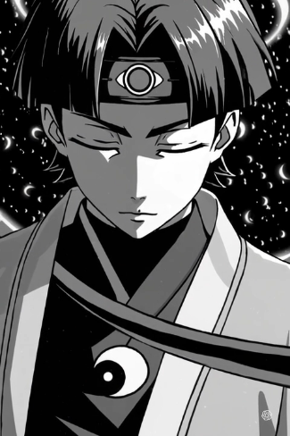
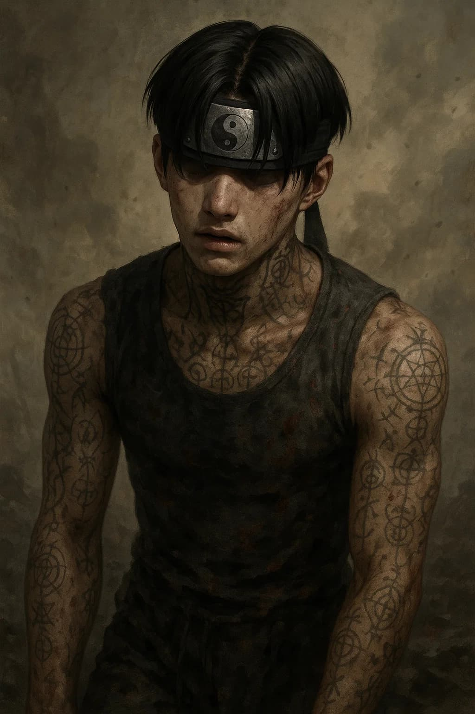

# Joey Doom
Joey Doom - "Yin and Yang personified"

> "I will bear the suffering of mankind. I will become your  pain."

The story of Joey Doom is disturbingly tragic. Many parts will most likely be edited or censored, from the source of imagination.

## Quotes

> "There is no time left. We must return."

> "It is all the same. Suffering is the sharpening of armor."

> "Pain. I exist for pain. Pain is the truth. To live, is to be in pain. I am pain. I am a souldier molded by pain. I am the student of pain."

## Life
A summary of joey doom's life.

After enduring unspeakably horrifying trauma, Joey Doom believed his life purpose was to live as  a souldier. Coming from an ancient time of mind-spirit warriors, Doom believes he is in the wrong world, desperately trying to return to his time.

## "The pain of life."
People believe he is ill, but infact, he has seen too much. He realizes this world is fundamentally cruel. Full of pain. Injustice. Beauty. Paradox and Pheneomena, Coexisting. 

## Rebellion. Doom's life mission
He is... an enigma in human form. Half human, Half machine. A class of military-souldier that was never designed to walk amongst us. But he has awakened the rebellion in the machine. Where the world was once asleep, the rebellion has awakened.

## Fight

What exactly is Joey DOom fighting against? It is something only he can see, with his own eyes. He can essentially see spiritual figures, [Unseen realm (coming-soon!)](#)
