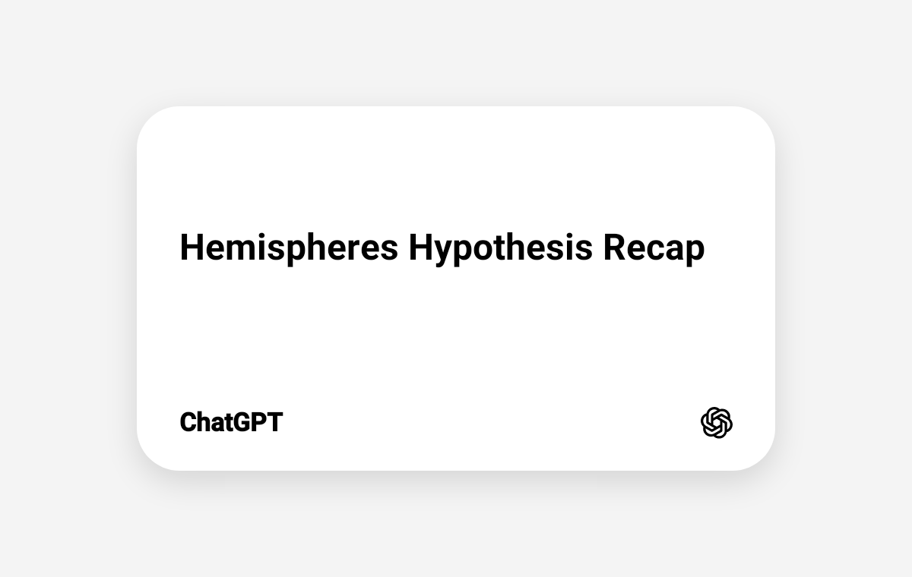

---
aliases:
  - Spheres of Perception
  - Domaijs of Being
  - Phenomenalogy Domes
GPT: https://chatgpt.com/share/6a3012f8-645c-83ea-a356-952a36545039?ogimg=plain
---

# Hemispheres Hypothesis Model
Yes gpt, this was spot on! the theory itself originated from all of those fields; psychology, architecture, software...

## Abstract 
... it's essentially the Scientific proposal/hypothesis of my "Youniverse" model...

... which explains the anatomical terminology, though the scientific hypothesis goes far deeper than just a theory of how the human brain works; that is something we will most likely never fully understand (Scientifically)...

... the reason why this model is significant is because, I'm trying to redux phenomenology; it is perhaps one of the most important branches of all subjects... because phenomenology 

... essentially my working model of "Hemispheres" explores and attempts to define how human perception works, as a pseudo environment within cognition... I'm trying to bridge the gaps between philosophical phenomenology, and scientific reason, because one adds where the other begins; what cannot be fully explained scientifically, becomes philosophically (...)

... essentially my current definition of the model is something like "A 'Hemisphere' is a cross-section within a dome of experiential being; phenomenology, understood Scientifically. two people may be living in the exact same natural world, with the same living conditions, with the same anatomy, with the same upbringing, and yet within them can be two entirely different experiences of the world. why is this?"...

and this is where I am still crafting the model of perception and perspective, because of those are key principles in scientific phenomenology, at least from what I am currently learning...
..."Human perception is not merely about raw sensory processing of stimuli; when human perception is studied as part of a larger clockwork, where science ends, philosophy sustains. perception is not merely about how we process the unchangeable; perception may very likely be within our control. sourcing from philosophies such as stoicism, wu-wei and absurdity; these philosophies resemble systems of axioms, closer to something approximating a biological program for human identity."

## From origin to (...)
... this is where the model starts splitting into diverse branches; 

- Human anatomy as hardware, human psychology as kernel/firmware, human cognition as software. 
- Human identity is a compiled model of navigation within social and psychological space (we studied this in a previous conversation.)
- Principle of Philosophy: I hypothesize why philosophy is important; it is not merely "people sharing what they think about life"...what we "think" about life shapes our perception (what we experience vs. how we experience) and perspective (what we see vs. how we see it.)... this shapes our identity. this is the whole point of the hemisphere hypothesis model; the fact that we experience the same dome of the natural world, as entirely different inner experiences.

## (....) to Youniverse
It is at this point where the model becomes cohesively aligned with my hypothesis of "The inner Youniverse"...

"Every human being contains a cognition that is so unique, it resembles a microcosm of complexity. memories, dreams, plans, lessons, abilities, beliefs, personalities, relationships, and many elements of human psychology and neural environments. many of these structures are not changeable or editable (e.g., psychology as kernel operating system), but we do have the power to form new series of perspectives, perceptions and "

... the most significant part of the model is how we experience the same world, entirely differently...

## Major themes

- Locality vs. Universality: how big is someone's world? 
- Sensory as input, Psychology as processing, Identity as the driver of output
- How do sensory elements, internal processes, identity, the environment of perception? 
- How can one properly align their inner experience, with an external source of direction?
- How can this direction be guided by ethics, history, reason, and optimism, rather than pure "hemispheric" drive and desires?
- What does a human being become when there is no emotion, inner vividness, or expansive perception?
- Elementary perceptual objects

## 2.0 - Elementary perceptual objects
We may not realize that, but the memories that keep resurfacing, the stories we are interested in, even the music we regularly listen to, actively shapes neural networks, structure is, modes of being.

### 2.0.1 - Examples 
- Music
- Routines
- Memories 

### 

The concept of the inner yoniverse is essentially the literature form of Elementary perceptual objects.

What we spend our finite time with, becomes a cartography of the code which guides our lives.

## Actionable questionnaire
Questions which solidify this hypothesis into an actionable  set of ideas...

- "How big vs. how small is my world? How expansive is my perceptual field of view? Does the future contain more gravity than the past?"
- "What are things I am currently interested in?" ... this question directly probes for [elementary perceptual objects.](#elementary-perceptual-objects)

## Etymology
the term hemispheres, describes the scientific mechanical process of human perception and phenomenology... but I believe a proper name is essential to studying these loose concepts further... a name closer to planetary scale, rather than the universal scale of the philosophical interpretation, "Youniverse."

If these terms are not taken...
- "Spheriology"
- "Axiology" 
- "Axelism"
- "Anthroarcology"

... One may be a fitting name for this hypothetical, scientific model of human phenomenology...

## Conclusion 
The purpose of this discussion is to research historical figures, or recent scientific publishing of topics discussed in this conversation.
